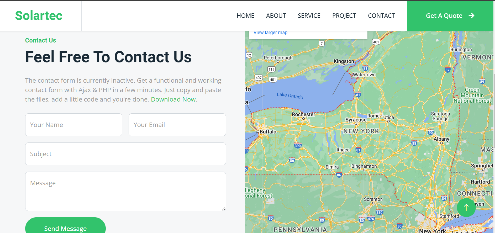

# My Solar Website

Welcome to my website! Here are some screenshots to give you a glimpse:

## Homepage

## About Page

## Contact page

## Project Page

## Quote Page

## Service Page

## Team

## Footer

## Key Features

- **Bootstrap 5**: Leverages Bootstrap 5 framework for responsive and mobile-friendly layout.

- **Google Web Font Support**: Integrates Google web fonts for a diverse range of typography options.

- **Bootstrap Icon Font Support**: Takes advantage of Bootstrap's icon font for scalable and customizable icons.

- **Clean and Well-Commented Code**: Maintains a codebase that is easy to understand, navigate, and modify.

- **Developer and SEO-Friendly Code**: Follows best practices for developer experience and search engine optimization.

- **Unique, Modern, and Flexible Layout**: Offers a distinctive and contemporary design with flexibility.

- **Compatible with All Web Browsers**: Ensures a consistent experience across various browsers.

- **Sticky and Mobile-Friendly Navbar**: Implements a sticky navigation bar that adapts well to mobile devices.

- **Responsive Hero Header**: Features a responsive hero header section for an impactful visual introduction.

- **Animation on Page Scrolling**: Incorporates animations to enhance the user experience while scrolling.

- **Fun Fact Counter**: Includes a counter for displaying fun and engaging facts.

- **Dropdown Menu Bar**: Implements a dropdown menu bar for organized navigation.

- **Testimonial Carousel**: Utilizes a carousel to showcase testimonials dynamically.

- **On-Hover Effects**: Enhances user interactivity with on-hover effects.

- **Social Links with Icons**: Integrates social links accompanied by icon representations.

- **“Back to Top” Button**: Provides a convenient button to navigate back to the top of the page.

- **Contact Form UI**: Offers a user-friendly contact form for easy communication.

- **Google Map**: Integrates Google Maps for location visualization.

- **Quotation Form UI**: Features a quotation request form with a pleasing user interface.

- **FontAwesome Icon Font**: Utilizes FontAwesome for a comprehensive collection of icons.

### HOW TO RUN THIS APP

# Getting Started with Create React App

This project was bootstrapped with [Create React App](https://github.com/facebook/create-react-app).

## Available Scripts

In the frontend directory, you can run:

### `npm start`

Runs the app in the development mode.\
Open [http://localhost:3000](http://localhost:3000) to view it in your browser.

The page will reload when you make changes.\
You may also see any lint errors in the console.

### `npm test`

Launches the test runner in the interactive watch mode.\
See the section about [running tests](https://facebook.github.io/create-react-app/docs/running-tests) for more information.

### `npm run build`

Builds the app for production to the `build` folder.\
It correctly bundles React in production mode and optimizes the build for the best performance.

The build is minified and the filenames include the hashes.\
Your app is ready to be deployed!

See the section about [deployment](https://facebook.github.io/create-react-app/docs/deployment) for more information.

### `npm run eject`

**Note: this is a one-way operation. Once you `eject`, you can't go back!**

If you aren't satisfied with the build tool and configuration choices, you can `eject` at any time. This command will remove the single build dependency from your project.

Instead, it will copy all the configuration files and the transitive dependencies (webpack, Babel, ESLint, etc) right into your project so you have full control over them. All of the commands except `eject` will still work, but they will point to the copied scripts so you can tweak them. At this point you're on your own.

You don't have to ever use `eject`. The curated feature set is suitable for small and middle deployments, and you shouldn't feel obligated to use this feature. However we understand that this tool wouldn't be useful if you couldn't customize it when you are ready for it.

## Learn More

You can learn more in the [Create React App documentation](https://facebook.github.io/create-react-app/docs/getting-started).

To learn React, check out the [React documentation](https://reactjs.org/).

### Code Splitting

This section has moved here: [https://facebook.github.io/create-react-app/docs/code-splitting](https://facebook.github.io/create-react-app/docs/code-splitting)

### Analyzing the Bundle Size

This section has moved here: [https://facebook.github.io/create-react-app/docs/analyzing-the-bundle-size](https://facebook.github.io/create-react-app/docs/analyzing-the-bundle-size)

### Making a Progressive Web App

This section has moved here: [https://facebook.github.io/create-react-app/docs/making-a-progressive-web-app](https://facebook.github.io/create-react-app/docs/making-a-progressive-web-app)

### Advanced Configuration

This section has moved here: [https://facebook.github.io/create-react-app/docs/advanced-configuration](https://facebook.github.io/create-react-app/docs/advanced-configuration)

### Deployment

This section has moved here: [https://facebook.github.io/create-react-app/docs/deployment](https://facebook.github.io/create-react-app/docs/deployment)

### `npm run build` fails to minify

This section has moved here: [https://facebook.github.io/create-react-app/docs/troubleshooting#npm-run-build-fails-to-minify](https://facebook.github.io/create-react-app/docs/troubleshooting#npm-run-build-fails-to-minify)
